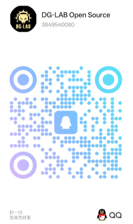

# DG-LAB Open Source

DG-LAB devices have gained recognition and love from friends worldwide. Many friends hope that our devices can participate in more scenarios. For this reason, we are sharing the Bluetooth protocols of DG-LAB's representative devices in open source form, allowing you to integrate DG-LAB devices into your own entertainment scenarios through countless other programming methods.

> The open source Bluetooth protocol is intended to give DG-LAB enthusiasts more freedom in using the devices. Please do not use this content for any commercial purposes without authorization. If needed, please [contact us](https://www.dungeon-lab.com)

## Coyote Adult Pulse Host
[Bluetooth Protocol V2](coyote/v2/README_V2.md)
[Bluetooth Protocol V3](coyote/v3/README_V3.md)
[SOCKET Control Protocol V3](socket/README.md)
[Coyote WEB Bluetooth Direct Connection Test](coyote/web/README.md)
[Pulse Waveform Explanation](coyote/extra/README.md)

## PawPrints Wireless Button Sensor
[External Voltage Detection Explanation and Usage Examples](PawPrints/extvoltageinput/README.md)

## Update Log
2025/04/23 -> Adjusted V3 Bluetooth protocol error corrections
2025/02/10 -> Added PawPrints external voltage detection explanation and usage examples
2024/10/28 -> Added V2/V3 waveform example data
2024/09/14 -> Updated V3 version socket control function QA documentation
2024/06/03 -> Updated V3 version socket control function frontend logic
2024/05/13 -> Updated Coyote WEB Bluetooth direct connection test
2024/04/25 -> Updated partial explanation of pulse waveforms
2024/01/11 -> Updated V3 version channel intensity and waveform output related protocols

V3 accessory gameplay related content and open source forms are under revision

Technical consultation QQ: 3849540080 (Only for open source technology related questions)

